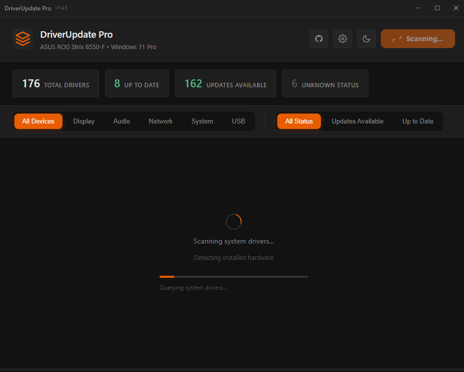
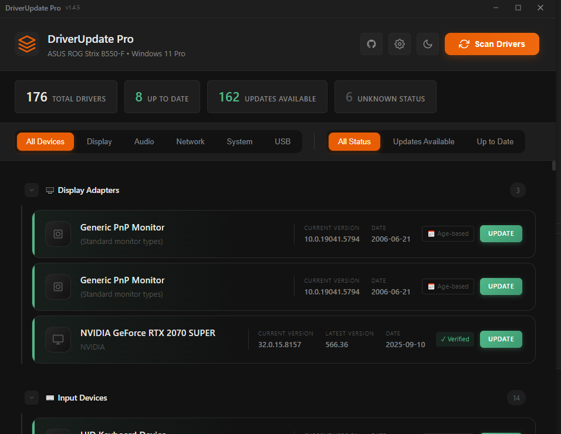

  

<h1 align="center">DriverUpdate Pro</h1>

  
  
  
  
  

  A professional Windows driver update scanner built with Electron.

> ⚠️ **Important Note:** This program helps you identify which drivers need updates, but does **not** automatically update them. You will need to manually download and install driver updates from the manufacturer's website.

---

## Screenshots

  

  

---

## Features

- **Scan System Drivers** - Detect all installed hardware drivers on Windows
- **Update Detection** - Check for available driver updates
- **Dark/Light Mode** - Comfortable viewing in any lighting
- **Category Filtering** - Filter by device type (Display, Audio, Network, etc.)
- **Status Filtering** - View all, updates available, or up-to-date drivers
- **Settings** - Customize auto-scan and update preferences
- **Auto-Updates** - App automatically checks for new versions

## Installation

1. Go to [Releases](https://github.com/belinda-hagen/DriverUpdate-Pro/releases)
2. Download the latest `.exe` installer
3. Run the installer
4. The app will auto-update when new versions are available

## License

This project is licensed under the **MIT License**. See the [LICENSE](LICENSE) file for details.

You are free to use, modify, and distribute this software for personal and commercial purposes.
